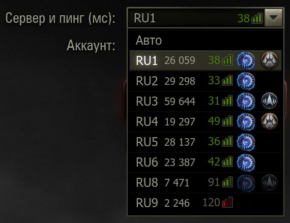
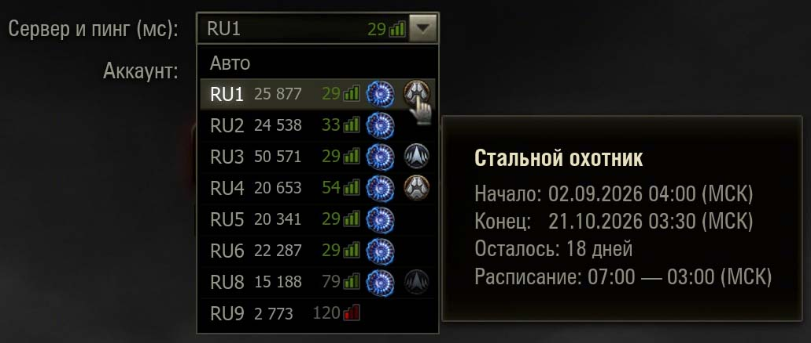
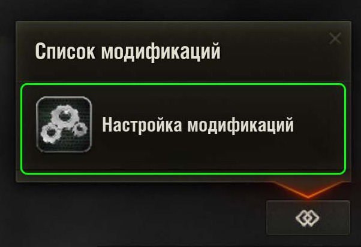
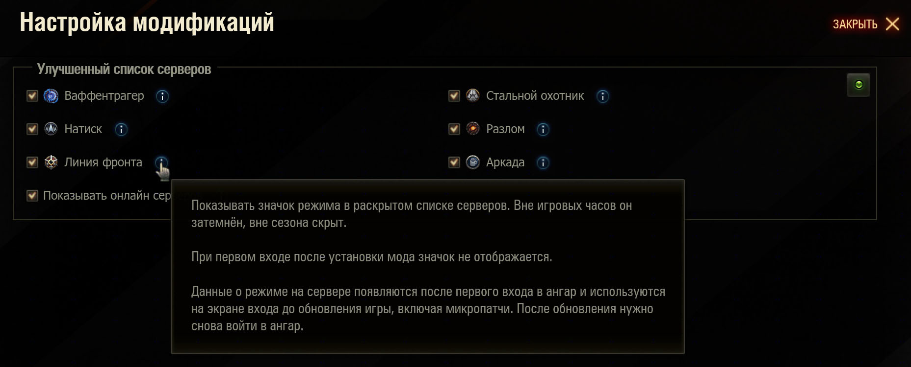

# Улучшенный список серверов

**Версия 1.0.0 · «Мир танков» · Автор: NIDIN**

Реальный онлайн RU-серверов, значки игровых режимов и их расписание прямо в раскрытом списке выбора сервера — на экране входа, в меню Esc и в окнах перехода на другой сервер.

**[Скачать мод](https://github.com/xNIDINx/improved-server-list/releases/latest)** · [Моды на nidin.ru](https://nidin.ru/mods)



## Возможности

- Реальный онлайн всех RU-серверов до авторизации. Общий кеш сервиса nidin.ru обновляется раз в 30 секунд.
- Шесть независимо выбираемых режимов: **Ваффентрагер, Натиск, Линия фронта, Стальной охотник, Разлом и Аркада**.
- Пинг выровнен в общей колонке; ширина списка автоматически увеличивается, если содержимому не хватает места.
- Онлайн и значки отображаются только в раскрытом списке. Закрытая строка выбора сохраняет штатный вид без этих дополнений.
- Яркий значок означает доступность режима сейчас; вне игровых часов он затемнён, вне сезона или цикла — скрыт.
- Подсказка показывает начало, конец, оставшееся время и расписание конкретного сервера. Часы указаны по Москве; для круглосуточного режима это отмечено отдельно.



Скриншоты иллюстрируют интерфейс. Онлайн, доступность режимов и даты меняются в соответствии с текущими данными.

## Установка

Для установки **обязательно нужны оба мода** из [каталога nidin.ru](https://nidin.ru/mods):

| Мод | Версия | Название в каталоге |
| --- | --- | --- |
| [ModsList API](https://gitlab.com/wot-public-mods/mods-list) | 1.6.01 | Меню с установленными модами |
| [ModsSettingsAPI](https://github.com/izeberg/modssettingsapi) | 1.7.0 | Настройки модов в игре |

Эти зависимости устанавливаются отдельно и не входят в пакет «Улучшенного списка серверов».

1. Закройте игру и установите обе зависимости для своего клиента.
2. Скачайте готовый файл `.mtmod` из [последнего релиза](https://github.com/xNIDINx/improved-server-list/releases/latest). Архивы исходников GitHub для установки не нужны.
3. Скопируйте файл без распаковки в папку текущей версии игры внутри `mods`: `mods/<версия игры>/`.
4. Запустите игру. Войдите в ангар, чтобы мод получил данные о режимах и сохранил их для следующих запусков.

После обновления игры проверьте совместимость мода с новым патчем и наличие обновлённого пакета в каталоге или последнем релизе.

## Настройки

В ангаре откройте **«Список модификаций» → «Настройки модификаций» → «Улучшенный список серверов»**. Карточка настроек также доступна на экране входа через ModsSettingsAPI.



Доступны общий выключатель мода, отдельный выбор каждого из шести режимов и переключатель **«Показывать онлайн серверов»**. По умолчанию включены Ваффентрагер, Натиск и онлайн. Кнопки «Применить» и «ОК» сохраняют выбор; «Отменить» и Esc отменяют изменения.



После применения настройки отключения онлайна **новые запросы не отправляются**, а ответ уже отправленного запроса игнорируется. При запуске с выключенным онлайном сетевой источник не создаётся.

## Первый запуск и кеш режимов

**До первого входа в ангар данных о режимах нет: значки и расписания не показываются.** Онлайн серверов работает независимо от этого кеша и доступен до авторизации при включённой настройке и доступном сервисе.

После входа в ангар мод использует настоящие конфигурации, полученные игровым клиентом, и сохраняет их в `mods/temp/nidin.improved_server_list/cache.json`. Встроенных расписаний или выдуманных списков серверов нет.

Кеш сохраняется между запусками до патча или микропатча. Он привязан к региону и точной сборке клиента, включая содержимое `version.xml`. После обновления игры **нужно снова войти в ангар**, даже если номер папки версии не изменился. До этого значки и расписания скрыты. При недоступном `version.xml` кеш также не используется.

Если сервис онлайна недоступен или ответ некорректен, неизвестные значения не заменяются нулём. Данные старше 180 секунд скрываются. Периодическое обновление общего кеша на сайте не означает запрос из игры каждые 30 секунд: мод ограничивает частоту обращений.

## Файл релиза и исходники

SHA256 файла `nidin.improved_server_list_1.0.0.mtmod`:

```text
9610CBB0930281338E790A6D314B16EE579B28844BEA730E58167F89A6ACFAA8
```

В репозитории опубликованы собственные исходники Python (`source/res/scripts/client/gui/mods/`), метаданные `source/meta.xml`, четыре класса ActionScript (`actionscript/`), скриншоты и документация. Клиентские исходники, SDK и инструменты рабочего окружения сюда не включены. Этот набор не является самостоятельным комплектом для воспроизводимой сборки; готовый пакет распространяется через [релизы](https://github.com/xNIDINx/improved-server-list/releases).

## Авторство и распространение

Автор — **NIDIN**. Полный текст условий: [LICENSE](LICENSE).

- Разрешено использовать мод и менять предусмотренные настройки.
- Разрешено распространять **неизменённые копии** с сохранением авторства и полного текста условий.
- **Изменение кода и распространение изменённых версий требуют разрешения автора.**

Это собственные условия автора, а не MIT. Публикация исходников не предоставляет права изменять их без разрешения. Условия относятся к собственному коду и материалам автора; права на игровые ресурсы и сторонние компоненты остаются у их правообладателей.
